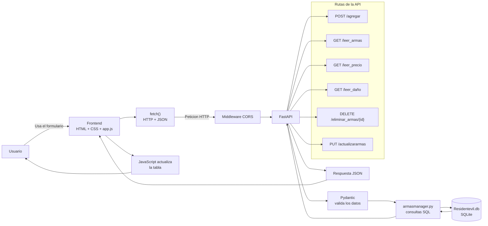
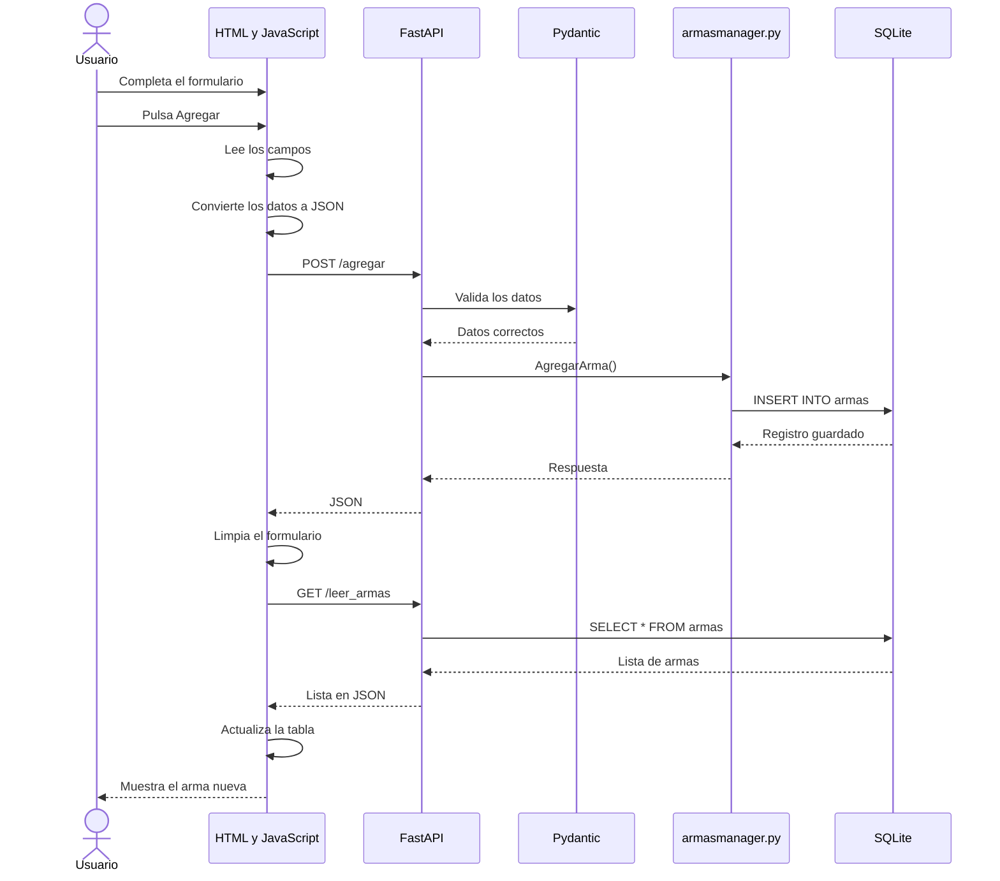

# Inventario de armas

Proyecto de una API hecha con FastAPI, SQLite y una pagina simple en HTML,
CSS y JavaScript.

## Como funciona



## Cuando se agrega un arma



## Como iniciar el proyecto

```bash
python3 -m uvicorn main:app --reload
```

La documentacion automatica de FastAPI queda disponible en:

```text
http://127.0.0.1:8000/docs
```
