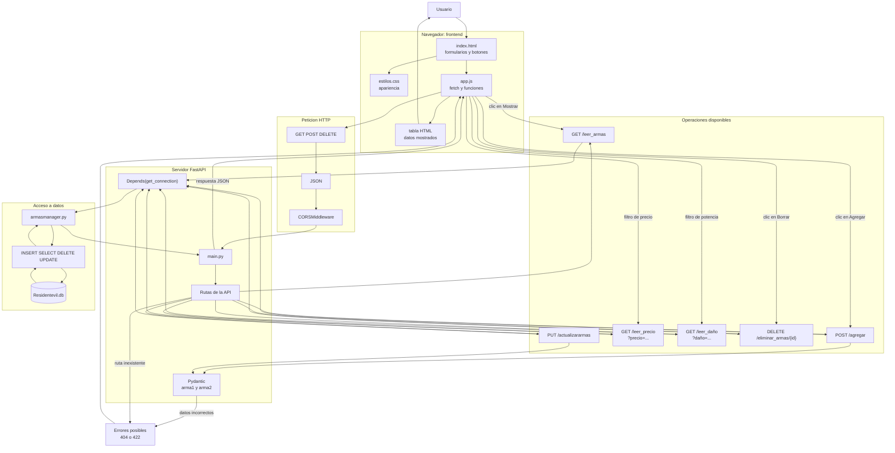

```mermaid
flowchart TD

    Usuario["Usuario"]

    subgraph Frontend["Navegador: frontend"]
        HTML["index.html<br>formularios y botones"]
        CSS["estilos.css<br>apariencia"]
        JS["app.js<br>fetch y funciones"]
        Tabla["tabla HTML<br>datos mostrados"]
    end

    subgraph Peticion["Peticion HTTP"]
        Metodo["GET POST DELETE"]
        JSON["JSON"]
        CORS["CORSMiddleware"]
    end

    subgraph Backend["Servidor FastAPI"]
        API["main.py"]
        Rutas["Rutas de la API"]
        Validar["Pydantic<br>arma1 y arma2"]
        Conexion["Depends(get_connection)"]
    end

    subgraph Operaciones["Operaciones disponibles"]
        Crear["POST /agregar"]
        Leer["GET /leer_armas"]
        Precio["GET /leer_precio<br>?precio=..."]
        Potencia["GET /leer_daño<br>?daño=..."]
        Borrar["DELETE /eliminar_armas/{id}"]
        Actualizar["PUT /actualizararmas"]
    end

    subgraph Datos["Acceso a datos"]
        Manager["armasmanager.py"]
        SQL["INSERT SELECT DELETE UPDATE"]
        SQLite[("Residentevil.db")]
    end

    Usuario --> HTML
    HTML --> CSS
    HTML --> JS

    JS -->|"clic en Mostrar"| Leer
    JS -->|"clic en Agregar"| Crear
    JS -->|"clic en Borrar"| Borrar
    JS -->|"filtro de precio"| Precio
    JS -->|"filtro de potencia"| Potencia

    JS --> Metodo
    Metodo --> JSON
    JSON --> CORS
    CORS --> API
    API --> Rutas

    Rutas --> Crear
    Rutas --> Leer
    Rutas --> Precio
    Rutas --> Potencia
    Rutas --> Borrar
    Rutas --> Actualizar

    Crear --> Validar
    Actualizar --> Validar
    Crear --> Conexion
    Leer --> Conexion
    Precio --> Conexion
    Potencia --> Conexion
    Borrar --> Conexion
    Actualizar --> Conexion

    Conexion --> Manager
    Manager --> SQL
    SQL --> SQLite
    SQLite --> SQL
    SQL --> Manager
    Manager --> API

    API -->|"respuesta JSON"| JS
    JS --> Tabla
    Tabla --> Usuario

    Error["Errores posibles<br>404 o 422"]
    Validar -->|"datos incorrectos"| Error
    Rutas -->|"ruta inexistente"| Error
    Error --> JS
```
