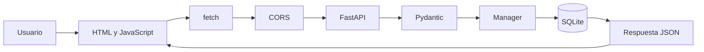

```mermaid
flowchart LR
    Usuario[Usuario] --> Pagina[HTML y JavaScript]
    Pagina --> Fetch[fetch]
    Fetch --> CORS[CORS]
    CORS --> API[FastAPI]
    API --> Validar[Pydantic]
    Validar --> Manager[Manager]
    Manager --> SQLite[(SQLite)]
    SQLite --> Respuesta[Respuesta JSON]
    Respuesta --> Pagina
```
